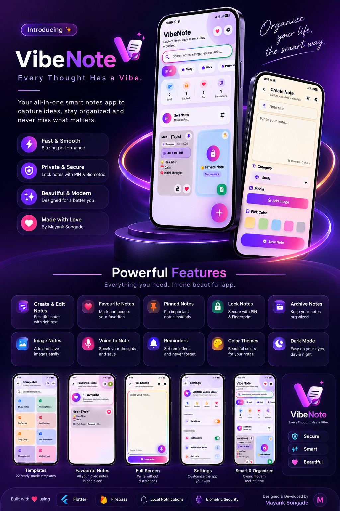

# VibeNote

### Every Thought Has a Vibe. ✨

VibeNote is a modern Flutter note-taking and productivity application built to make capturing, organizing, and protecting personal thoughts simple and intuitive.

It combines a visually rich glassmorphism interface with practical features such as voice notes, reminders, image notes, categories, and app security.

---

## 📱 App Showcase

<p align="center">
  
</p>

---

## ✨ Features

### 📝 Note Management
- Create and edit notes
- Delete notes
- Favourite notes
- Pin important notes
- Archive notes
- Organize notes with categories
- Create image-based notes

### 🎙️ Voice & Media
- Voice-to-note functionality
- Image notes
- Fullscreen image viewing

### 🔔 Reminders
- Create reminders for notes
- Custom notification sounds
- Reminder actions for opening or completing reminders

### 🔐 Privacy & Security
- App PIN lock
- Fingerprint / biometric authentication
- PIN fallback authentication
- Lock individual notes

### 🎨 User Experience
- Modern glassmorphism UI
- Dark mode
- Light mode
- Gradient-based visual design
- Smooth animations and interactions
- Clean and responsive mobile interface

---

## 🛠️ Tech Stack

| Technology | Usage |
|------------|-------|
| **Flutter** | Cross-platform mobile development |
| **Dart** | Application programming language |
| **Firebase** | Backend / supporting services |
| **SharedPreferences** | Local data persistence |
| **Local Notifications** | Reminder notifications |
| **Material Design** | UI components |

---

## 🧠 What I Practiced

While building VibeNote, I worked with several important Flutter development concepts:

- Flutter UI development
- Stateful and reactive UI
- Local data persistence
- App-level state management
- Navigation between screens
- Notification scheduling
- Custom notification sounds
- Device biometric authentication
- PIN-based security
- Image handling
- Voice input
- Dark and light themes
- Reusable UI components
- Responsive mobile layouts

---

## 🎯 Project Highlights

VibeNote focuses on combining **functionality with a distinctive visual identity**.

The application was designed around three main principles:

**Capture**  
Quickly save ideas using text, images, or voice.

**Organize**  
Use favourites, pins, archives, categories, and reminders to keep notes manageable.

**Protect**  
Secure private information using PIN and biometric authentication.

---

## 📂 Project Structure

```text
VibeNote/
│
├── android/
├── ios/
├── linux/
├── macos/
├── web/
│
├── assets/
│
├── lib/
│   ├── models/
│   ├── screens/
│   ├── services/
│   ├── widgets/
│   └── ...
│
├── test/
│
├── pubspec.yaml
├── analysis_options.yaml
├── README.md
└── LICENSE
